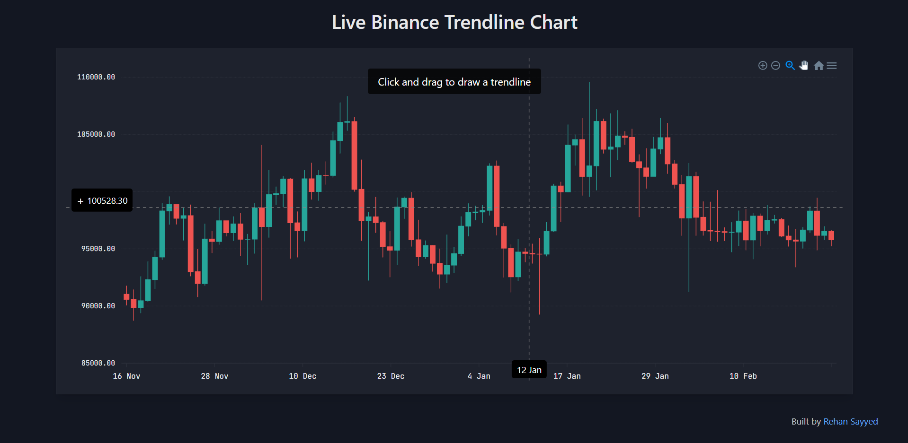
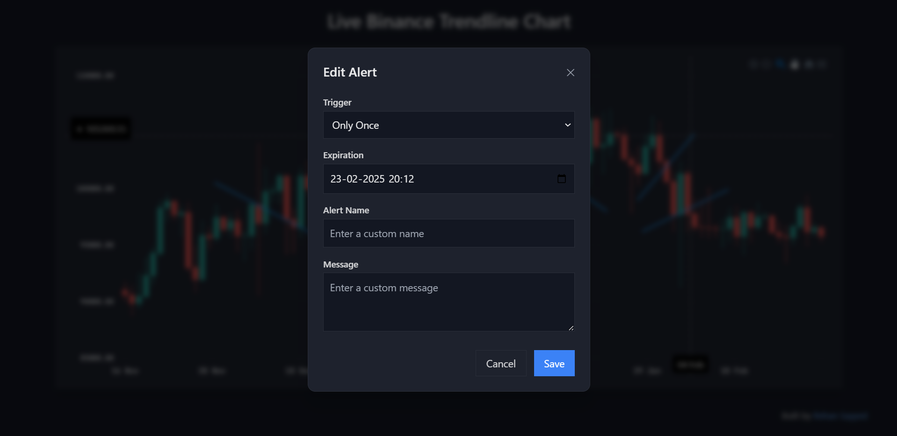
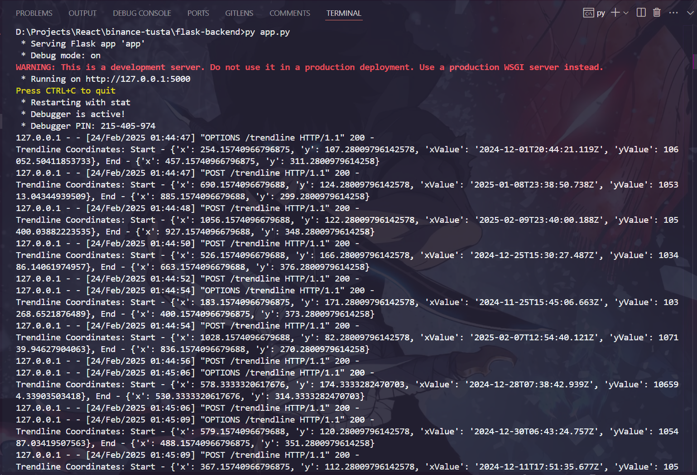

# Binance Trendline Assignment  

## 📌 About  
This project is an **internship assignment** focused on implementing a **trendline feature** using **Binance's live data**. The application allows users to **draw trendlines** on a custom chart and configure alerts via a modal. The data is sent to a **Flask backend** for processing.  

## 📁 Project Structure  
```
rsayyed591-binance-tusta/
├── flask-backend/
│   ├── app.py
│   └── requirement.txt
└── frontend/
    ├── public/                  # Screenshots & assets
    │   ├── home.png
    │   ├── modal.png
    │   └── backend-response.png
    ├── src/
    │   ├── App.jsx
    │   ├── index.css
    │   ├── main.jsx
    │   ├── components/
    │   │   ├── Chart.jsx
    │   │   ├── Modal.jsx
    │   │   └── Trendline.jsx
    │   └── utils/
    │       └── api.js
    ├── package.json
    ├── vite.config.js
    ├── tailwind.config.js
    ├── README.md
    └── .gitignore
```

## 🚀 Technologies Used  
### **Frontend:**  
- **React (JSX)** – For UI and interactivity  
- **ApexCharts** – For custom chart rendering  
- **Framer Motion** – For smooth animations  
- **Tailwind CSS** – For modern styling  
- **Vite** – For fast development  

### **Backend:**  
- **Flask** – Lightweight Python backend  
- **CORS** – To enable frontend-backend communication  

### **Deployment:**  
- **Frontend:** [Vercel](https://binance-tusta.vercel.app/)  
- **Backend:** Local Flask server  

## 📌 Approach  
1. **Chart Rendering:**  
   - Used **ApexCharts** to display Binance live data.  
   - Allowed users to draw trendlines using **mouse interactions**.  

2. **Trendline Data Handling:**  
   - Captured **start and end coordinates** of a drawn trendline.  
   - Sent the data to a Flask API using a `POST` request.  

3. **Alert System with Modal:**  
   - Added a **Framer Motion modal** for setting alerts on trendlines.  
   - Allowed users to configure **trigger type, expiration, name, and message**.  

4. **Backend Integration:**  
   - The Flask server receives the **trendline coordinates**, logs them, and sends a response.  
   - The backend could be extended to **store data in a database**.  

## 🔍 Features Implemented  
✅ **Custom Charting (Without TradingView)**  
✅ **Trendline Drawing**  
✅ **Right-Click to Open Alert Modal**  
✅ **Modal with Alert Configurations**  
✅ **Data Sent to Flask API**  
✅ **Sleek, Fintech-Inspired UI**  

## 🌐 Live Website  
🔗 **[binance-tusta.vercel.app](https://binance-tusta.vercel.app/)**  

## 🖼️ Screenshots  
### 📊 Main Chart Page  
  

### ⚙️ Modal with Alert Configurations  
  

### 🔥 Flask Backend Response  
  

## ✨ Author  
👤 **Rehan Sayyed**  
- GitHub: [rsayyed591](https://github.com/rsayyed591)
- LinkedIn: [rehan42](https://www.linkedin.com/in/rehan42/)
